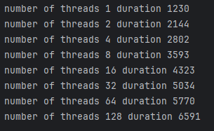

تم استخدام حاسب Dell يحوي معالج Intel Core i7 8th gen وذاكرة 8GB Ram 

في هذه الطريقة لافرق بين التقسيم كخطوط او بلوكات الفرق فقط في توزيع الحمل على كل نسيب ولكن يمكن التوصيل الى نفس الاداء فقط بتعديل عدد النياسب
إما في حال كان التعديل مختلف عن تغيير لون مثلا يتعلق القدرة الحسابية باللون سيكون من الافضل التقسيم لبلوكات من اجل تجنب حالات الاختناق

كما نرى زمن تنفيذ باستخدام اعداد مختلفة من النياسب